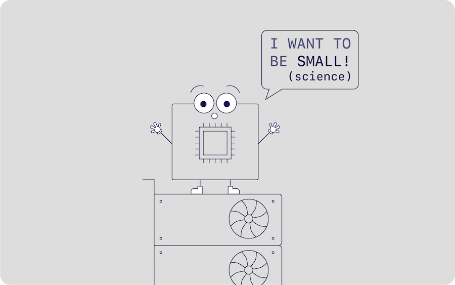

# SmallScience

SmallScience (inspired by the amazing [BigScience](https://bigscience.huggingface.co/)) is my humble learning experience to train a large (but not too large) transformer model.

My TLDR goals:

* Explore determining the optimal model and dataset for my (currently) non-existent compute, and how to make training as efficient as possible 
* To learn what techniques/tricks in practice make [BigScience](https://bigscience.huggingface.co/), [GPT-NeoX](https://github.com/EleutherAI/gpt-neox) or Large transformer model training possible. I've learnt a lot about the theory, but I want to put it into practice!
* Code in a way that is comfortable for extension/modifiability. This means relying on open source as much as possible, using libraries to handle the boilerplate.
* Hopefully train a large(ish) model and provide a useful codebase :)

I would love this to be a joint effort with people from the community, so more than happy to collaborate with others!

All my progress/mistakes/thoughts current can be found in the [issues](https://github.com/SeanNaren/SmallScience/issues).
